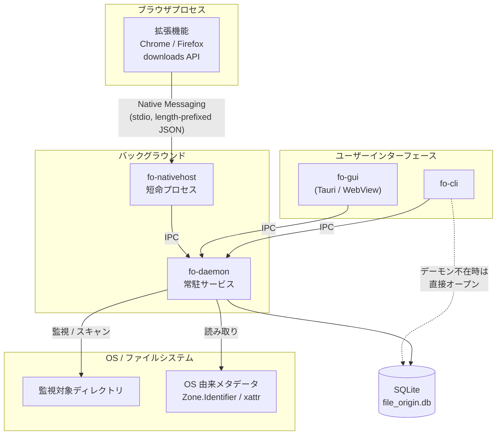

# File Origin

> ダウンロードしたファイルの **入手元・来歴** を記録し、後から確認できるようにするローカル完結型の OSS。

ファイルは残るが、**どこから来たか**は残らない。File Origin はその欠落した 1 行を、ダウンロードの瞬間に拾って保管し続ける。

- 🖥 **Windows / Linux 対応**（ネイティブ実装、単一バイナリ）
- 🔒 **ローカル完結** — 外部送信なし
- 🧩 **ブラウザ連携** — Chrome / Firefox 拡張＋Native Messaging
- 🔁 **移動・リネーム追跡** — ファイルが動いても追い続ける

> **Status: M1 実装中（雛型あり・未検証）**
> 本 README はアーキテクチャ設計文書を兼ねます。
> - 設計判断とその理由: [docs/adr/](docs/adr/)・[未決事項](#15-未決事項decision-log)
> - 既存 OSS・製品の調査: [docs/prior-art.md](docs/prior-art.md)（完了）
> - 何がどこまで動くか: [現在の実装状況](#現在の実装状況)
>
> ⚠️ **雛型はまだコンパイル検証されていません。** 最初のビルドでエラーが出る可能性があります（[検証手順](#13-ビルド配布)）。

---

## 目次

1. [プロジェクト概要](#1-プロジェクト概要)
2. [想定ユーザー](#2-想定ユーザー)
3. [機能スコープ](#3-機能スコープ)
4. [設計方針](#4-設計方針)
5. [システム構成](#5-システム構成)
6. [レイヤーアーキテクチャ](#6-レイヤーアーキテクチャ)
7. [プラットフォーム抽象化層](#7-プラットフォーム抽象化層)
8. [ファイル同一性の追跡戦略](#8-ファイル同一性の追跡戦略)
9. [入手元の取得経路](#9-入手元の取得経路)
10. [データモデル](#10-データモデル)
11. [プロセス構成と IPC](#11-プロセス構成と-ipc)
12. [リポジトリ構成](#12-リポジトリ構成)
13. [ビルド・配布](#13-ビルド配布)
14. [セキュリティとプライバシー](#14-セキュリティとプライバシー)
15. [未決事項（Decision Log）](#15-未決事項decision-log)
16. [ロードマップ](#16-ロードマップ)

---

## 1. プロジェクト概要

### コンセプト

ダウンロードしたファイルの入手元・来歴を記録し、後から簡単に確認できるようにする。

### 解決したい問題

| 課題 | 現状 |
| --- | --- |
| このファイルをどこからダウンロードしたか分からない | ファイル名しか手がかりがない |
| 元の配布サイトを見つけられない | 検索し直すしかない |
| 最新版に更新したいが入手元が分からない | 配布元を再特定するコストが高い |
| ファイルの安全性や入手経路を確認したい | 後から検証する手段がない |

### 差別化の方向性

単なるダウンロード履歴ではなく、**ファイルと入手元の関係を、ファイルが移動しても継続的に管理する**ことを目指す。

- ブラウザとファイルシステムの連携
- 入手元 URL の永続保存
- ファイルの来歴（いつ・どこから・どう変わったか）の確認
- ファイルの移動・名前変更への追従
- ローカル完結・プライバシー重視

### 既存プロジェクトとの関係

既存 OSS・製品を調査した（[docs/prior-art.md](docs/prior-art.md)）。その結論として、File Origin の立ち位置は **次の 3 つの交差点** にある。

| 軸 | 内容 |
| --- | --- |
| **A. 汎用性** | メディア・論文・Mod などに限定せず、あらゆるファイルを対象にする |
| **B. in-place** | ユーザーのフォルダ構成を変えず、その場にあるファイルを記録する（取り込まない） |
| **C. 移動追跡** | ファイルが移動・リネームされても関連付けを維持する |

個々の要素には既存事例が多数あるが、**A・B・C を同時に満たす OSS は見つからなかった。**

| 既存 | 満たす軸 | 満たさない軸 |
| --- | --- | --- |
| [WhereFrom](https://github.com/opsorart/WhereFrom)（最も近い） | A・B | **C なし。** Windows 専用・CLI のみ・DB なし・Zone.Identifier を読むだけ |
| [hydrus network](https://hydrusnetwork.github.io/hydrus/) | C | **A・B なし。** メディア特化・ファイルを import する |
| [git-annex](https://git-annex.branchable.com/) / DataLad | B・C | **A なし。** git リポジトリ内が前提 |
| [TagSpaces](https://github.com/tagspaces/tagspaces) | A・B | **C なし。** 入手元の自動記録が主眼ではない |
| Eagle（商用） | C | **A・B なし。** 素材特化・import・非 OSS・Linux 非対応 |
| Zotero / Calibre / Vortex | C | **A なし。** それぞれ論文・書籍・Mod に特化 |
| ブラウザのダウンロード履歴 | — | **C なし。** 移動・リネームで紐付けが切れる |

> **棲み分け**: Nexus Mods 経由の Mod なら Vortex、論文なら Zotero の方が優れている。
> File Origin の価値は **それらの領域の外にあるファイル** — 個人サイトから拾った Mod、配布元が消えたツール、素材サイトの画像 — にある。

---

## 2. 想定ユーザー

**ファイル管理をアプリに明け渡すつもりはないが、入手元は残したい人。**

- PC を日常的に利用する人
- ソフトウェアやツールをダウンロードする人
- ゲーム・Mod を導入する人
- 画像・フォントなどの素材を集める人
- 開発者・OSS 利用者

### どこで使うものか — ドメイン特化ツールとの棲み分け

領域が決まっているなら、その領域の専用ツールの方が優れている。File Origin はそれらを置き換えない。

| その領域なら | 専用ツールを使うべき |
| --- | --- |
| Nexus Mods 経由の Mod | Vortex / Mod Organizer 2 |
| 論文・PDF | Zotero |
| 電子書籍 | Calibre |
| 対応サイトからの画像・動画 | gallery-dl / yt-dlp |

**File Origin の居場所は、その外側にあるファイル。**

- 個人サイトや掲示板から拾ってきた Mod・ツール
- 配布元が消えてしまったソフトウェア
- 専用ツールが対応していないサイトの素材
- そもそもどのカテゴリにも属さない、雑多なダウンロード

これらは既存のどのツールも面倒を見ておらず、**ブラウザの履歴が切れた時点で出所が永久に分からなくなる**。そこを埋める。

---

## 3. 機能スコープ

### MVP（v0.1）

| # | 機能 | 内容 |
| --- | --- | --- |
| ① | ファイルの入手元記録 | ファイル名 / パス / 入手元 URL / 取得日時 / SHA-256 / メモ |
| ② | ブラウザ連携による自動記録 | 拡張機能がダウンロード完了を検知し、URL とファイルを関連付ける |
| ③ | 検索 | ファイル名・入手元 URL・取得日時・現在の保存場所 |
| ④ | ファイル移動への対応 | 移動・リネームを検知して追従。取りこぼしは再スキャンで補正 |

### スコープ外（当面）

- クラウド同期・アカウント機能
- macOS 対応（[§15](#15-未決事項decision-log) 参照。設計上は拡張可能にしておく）
- ファイルの中身の解析・ウイルススキャン

---

## 4. 設計方針

本プロジェクトの設計判断はすべて以下の原則に従う。

| # | 原則 | 意味 |
| --- | --- | --- |
| P1 | **プラットフォーム差はただ 1 層に閉じ込める** | `#[cfg(target_os = ...)]` は `fo-platform` クレートの外に書かない。コアは OS を知らない |
| P2 | **UI はコアの上の薄い層** | CLI も GUI も同じコア API を呼ぶ。ロジックを UI に持たせない |
| P3 | **ローカル完結** | ネットワーク送信を行うコードをコアに入れない |
| P4 | **劣化して動く（Graceful degradation）** | 特権 API が使えなくても、精度を落として機能する |
| P5 | **出所を明示する** | 記録した入手元がどの経路で得られたかと、その確度を必ず保持する |
| P6 | **ユーザーのファイルを書き換えない** | 既定では読み取りのみ。メタデータ書き戻しはオプトイン |

> **P4 の具体例** — Linux の `fanotify` は `CAP_SYS_ADMIN` を要求する。使えない環境では `inotify` ＋ 定期スキャンに自動フォールバックし、「リアルタイム性が落ちる」だけで機能は失わない。

---

## 5. システム構成



### データの流れ（ダウンロード時）

```
1. ユーザーがブラウザでダウンロード
2. 拡張機能が downloads.onChanged で state === "complete" を検知
       ↓ url / referrer / finalUrl / filename / mime / bytes
3. Native Messaging で fo-nativehost に送信
       ↓ IPC
4. fo-daemon が受信 → 実ファイルを開き、安定識別子と SHA-256 を取得
       ↓
5. SQLite に files / file_paths / origins を記録
```

### データの流れ（後から確認するとき）

```
fo show ./setup.zip  または  GUI でファイルを選択
       ↓
安定識別子でレコードを引く（見つからなければ SHA-256 で引く）
       ↓
入手元 URL / 取得日時 / 経路と確度 / パス履歴 を表示
```

---

## 6. レイヤーアーキテクチャ

依存は **上から下への一方向のみ**。下位レイヤーは上位を知らない。

```
┌─────────────────────────────────────────────────────────────┐
│  プレゼンテーション層                                          │
│  fo-gui (Tauri)      fo-cli      fo-nativehost      拡張機能  │
└───────────────────────────┬─────────────────────────────────┘
                            │ 同一のユースケース API を呼ぶ
┌───────────────────────────▼─────────────────────────────────┐
│  アプリケーション層   fo-core::usecase                        │
│  record_origin / track_move / search / verify / rescan      │
└──────────┬────────────────────────────────┬─────────────────┘
           │                                │
┌──────────▼──────────────┐  ┌──────────────▼─────────────────┐
│  ドメイン層 fo-core      │  │  サービス層                     │
│  FileRecord / Origin    │  │  fo-store   (SQLite)           │
│  StableFileId / Digest  │  │  fo-watcher (監視エンジン)       │
│  ※ OS を一切知らない     │  │  fo-ipc     (プロトコル)         │
└──────────┬──────────────┘  └──────────────┬─────────────────┘
           │                                │
┌──────────▼────────────────────────────────▼─────────────────┐
│  ★ プラットフォーム抽象化層  fo-platform                      │
│     trait のみを公開し、実装を cfg で切り替える                 │
│  ┌──────────────────────┐  ┌──────────────────────┐         │
│  │  windows/            │  │  linux/              │         │
│  │  #[cfg(windows)]     │  │  #[cfg(target_os =   │         │
│  │  windows-rs          │  │    "linux")]  nix    │         │
│  └──────────────────────┘  └──────────────────────┘         │
└─────────────────────────────────────────────────────────────┘
```

### なぜこの形か

- **`fo-core` は OS を知らない** → 全ロジックを Windows でも Linux でも同じテストで検証できる
- **`fo-platform` は trait のみ公開** → モック実装を挿せるので、コアのテストに実 OS が要らない
- **新 OS 対応 = `fo-platform` に 1 ディレクトリ追加**。他クレートは 1 行も変わらない

### クレート責務

| クレート | 種別 | 責務 | OS 依存 |
| --- | --- | --- | --- |
| `fo-core` | lib | ドメインモデル・ユースケース | ❌ なし |
| `fo-platform` | lib | **OS 抽象化 trait とその実装** | ✅ **ここだけ** |
| `fo-store` | lib | SQLite 永続化・マイグレーション | ❌ なし |
| `fo-watcher` | lib | 監視・スキャン・同一性解決のエンジン | ❌（`fo-platform` 経由） |
| `fo-ipc` | lib | IPC のメッセージ定義とクライアント / サーバ | ❌（`fo-platform` 経由） |
| `fo-daemon` | bin | 常駐サービス本体 | ❌ |
| `fo-cli` | bin | コマンドラインインターフェース | ❌ |
| `fo-nativehost` | bin | Native Messaging ホスト | ❌ |

> **不変条件（CI で機械的に検査する）**
> `fo-platform` 以外のクレートに `#[cfg(windows)]` / `#[cfg(target_os = "linux")]` / `windows-rs` / `nix` が現れたら **ビルドを落とす**。
> 設計を口約束にせず、テストで守る。

---

## 7. プラットフォーム抽象化層

**このプロジェクトの中核**。Windows と Linux の差異はすべてここに列挙され、ここにしか存在しない。

### 7.1 公開する trait

```rust
// crates/fo-platform/src/lib.rs   ── OS 非依存の型と trait のみ

/// 移動・リネームを跨いで不変なファイル識別子
pub struct StableFileId {
    pub volume: VolumeId,  // Win: VolumeSerialNumber / Linux: st_dev
    pub file:   FileKey,   // Win: FileId128          / Linux: st_ino
}

pub trait FileIdentity {
    /// パスから安定識別子を取得する
    fn stable_id(&self, path: &Path) -> Result<StableFileId>;
    /// 安定識別子から現在のパスを解決する（OS が対応していれば）
    fn resolve_path(&self, id: &StableFileId) -> Result<Option<PathBuf>>;
    /// 逆引きが OS ネイティブに可能か（Linux は false → DB 索引で代替）
    fn supports_reverse_lookup(&self) -> bool;
}

pub trait OriginMetadata {
    /// OS が保持する入手元メタデータを読む。
    /// 経路が複数ありうる（Linux は xattr と GVFS の 2 系統）ので Vec を返し、
    /// どこから読んだかは OsOrigin::source が持つ
    fn read_origin(&self, path: &Path) -> Result<Vec<OsOrigin>>;
    /// この環境で実際に使える読み取り経路（fo doctor が表示する）
    fn available_sources(&self) -> Vec<OriginSource>;
    /// 自前の記録を OS メタデータとして書き戻す（オプトイン・既定 OFF）
    fn write_origin(&self, path: &Path, origin: &OsOrigin) -> Result<()>;
}

pub trait FsWatcher: Send {
    fn watch(&mut self, root: &Path, recursive: bool) -> Result<WatchHandle>;
    fn unwatch(&mut self, handle: WatchHandle) -> Result<()>;
    /// rename は可能な限り from/to を対にして返す
    fn poll_events(&mut self, timeout: Duration) -> Result<Vec<FsEvent>>;
}

/// アプリ停止中の変更を後から拾うための変更ジャーナル
pub trait ChangeJournal {
    fn capability(&self) -> JournalCapability;   // Full | None
    fn read_since(&self, cursor: &JournalCursor)
        -> Result<(Vec<ChangeRecord>, JournalCursor)>;
}

pub trait PlatformPaths {
    fn data_dir(&self)    -> PathBuf;
    fn config_dir(&self)  -> PathBuf;
    fn cache_dir(&self)   -> PathBuf;
    fn log_dir(&self)     -> PathBuf;
    fn runtime_dir(&self) -> PathBuf;
    fn default_download_dirs(&self) -> Vec<PathBuf>;
}

pub trait IpcTransport {
    fn bind(&self, name: &str)    -> Result<Box<dyn IpcListener>>;
    fn connect(&self, name: &str) -> Result<Box<dyn IpcStream>>;
}

pub trait Autostart {
    fn enable(&self)     -> Result<()>;
    fn disable(&self)    -> Result<()>;
    fn is_enabled(&self) -> Result<bool>;
}

pub trait NativeHostInstaller {
    /// ブラウザごとに異なるマニフェスト設置先へインストールする
    fn install(&self, browser: Browser, manifest: &HostManifest) -> Result<()>;
    fn uninstall(&self, browser: Browser) -> Result<()>;
}

/// すべてを束ねるエントリポイント。アプリは常にこれだけを受け取る
pub trait Platform: Send + Sync {
    fn identity(&self)       -> &dyn FileIdentity;
    fn origin_meta(&self)    -> &dyn OriginMetadata;
    fn paths(&self)          -> &dyn PlatformPaths;
    fn ipc(&self)            -> &dyn IpcTransport;
    fn autostart(&self)      -> &dyn Autostart;
    fn host_installer(&self) -> &dyn NativeHostInstaller;
    fn new_watcher(&self)    -> Result<Box<dyn FsWatcher>>;
    fn journal(&self)        -> Option<&dyn ChangeJournal>;

    /// 実行環境の実力を診断する（`fo doctor` が表示する）
    fn capabilities(&self) -> Capabilities;
}

/// 唯一の cfg 分岐点
pub fn current() -> Box<dyn Platform> {
    #[cfg(windows)]
    { Box::new(windows::WindowsPlatform::new()) }
    #[cfg(target_os = "linux")]
    { Box::new(linux::LinuxPlatform::new()) }
}
```

### 7.2 プラットフォーム対応表

| 抽象 | Windows 実装 | Linux 実装 |
| --- | --- | --- |
| **安定識別子** | `GetFileInformationByHandleEx` / `FILE_ID_INFO`<br/>（`VolumeSerialNumber` + `FileId128`） | `statx()` の `(st_dev, st_ino)` |
| **識別子 → パス逆引き** | `OpenFileById` で **OS がネイティブ対応** | **不可** → DB 索引＋再スキャンで代替 |
| **入手元メタデータ** | NTFS 代替データストリーム<br/>`file:Zone.Identifier`<br/>（`ZoneId` / `ReferrerUrl` / `HostUrl`）<br/>✅ 主要ブラウザが自動で書く | ① 拡張属性 `user.xdg.origin.url`<br/>　→ ⚠️ wget / curl `--xattr` のみ<br/>② GVFS メタデータ `metadata::download-uri`<br/>　→ Firefox はここに書く（オプトイン） |
| **リアルタイム監視** | `ReadDirectoryChangesW` | `inotify` |
| **網羅的な変更検出**<br/>（任意・要特権） | NTFS USN Change Journal<br/>（要 Administrator、保持は約 1 週間） | `fanotify`（`FAN_REPORT_FID`）<br/>（要 `CAP_SYS_ADMIN`） |
| **上記が使えない場合** | 差分スキャン（**既定**） | 差分スキャン（**既定**） |
| **IPC** | 名前付きパイプ<br/>`\\.\pipe\file-origin` | Unix ドメインソケット<br/>`$XDG_RUNTIME_DIR/file-origin.sock` |
| **自動起動** | タスクスケジューラ（ログオン時） | `systemd --user` unit |
| **データ配置** | `%LOCALAPPDATA%\FileOrigin\` | `$XDG_DATA_HOME/file-origin/`<br/>（既定 `~/.local/share/file-origin/`） |
| **設定配置** | `%APPDATA%\FileOrigin\` | `$XDG_CONFIG_HOME/file-origin/` |
| **既定の監視対象** | `%USERPROFILE%\Downloads` | `xdg-user-dir DOWNLOAD` |
| **Native Messaging<br/>マニフェスト** | レジストリ<br/>`HKCU\Software\Google\Chrome\NativeMessagingHosts\`<br/>`HKCU\Software\Mozilla\NativeMessagingHosts\` | `~/.config/google-chrome/NativeMessagingHosts/`<br/>`~/.mozilla/native-messaging-hosts/` |
| **GUI レンダラ** | WebView2（Edge ランタイム） | WebKitGTK |
| **配布形式** | MSI / NSIS / winget | `.deb` / `.rpm` / AppImage / Flatpak |

### 7.3 プラットフォーム間の非対称性と、その埋め方

設計上いちばん厄介なのはこの 2 点。**対称なふりをしない**のが方針。

**① 識別子からパスへの逆引き**

Windows は `OpenFileById` で OS が直接答えられるが、Linux に inode → path の一般的な逆引きは存在しない。
→ `supports_reverse_lookup()` で能力を明示し、Linux では `file_paths` テーブルの索引＋スキャンで解決する。
コア側は「逆引きは失敗しうる」前提で書かれるため、Windows でも同じコードパスが通る。

**② 停止中の変更検出 — 両 OS とも「特権があれば速い」**

アプリが止まっていた間の変更をどう拾うか。両 OS に「完全だが特権が要る」経路と「遅いが誰でも使える」経路がある。

| | 特権あり（完全・高速） | 特権なし（**既定**） |
| --- | --- | --- |
| Windows | USN Change Journal<br/>要 **Administrator**、保持は約 1 週間 | 差分スキャン |
| Linux | `fanotify`（`FAN_REPORT_FID`）<br/>要 **`CAP_SYS_ADMIN`** | 差分スキャン |

**既定では両 OS とも差分スキャンで動く。** 特権を与えれば精度と速度が上がる、という位置づけ。
これは設計方針 P4（劣化して動く）と P6 の「管理者 / root を要求しない」を両立させるための選択で、`JournalCapability` が `Full` / `None` を返すことで表現される。

> ⚠️ USN Journal の 2 つの限界を見落とさないこと。
> ① **保持期間は約 1 週間** — それより古いカーソルからは読み直せず、結局スキャンが要る
> ② **Administrator 権限が必要** — ボリュームハンドル `\\.\C:` を開く時点で昇格が要る
> 詳細は [docs/prior-art.md §6 F2](docs/prior-art.md#f2-️-usn-change-journal--完全に追えるは誤り)。

```
$ fo doctor
Platform          : Linux (x86_64)
Stable file ID    : ✅ statx (st_dev, st_ino)
Reverse lookup    : ⚠️  OS 非対応 — DB 索引で代替します
Origin metadata   : ⚠️  xattr (user.xdg.origin.url) — 読めますが、
                       主要ブラウザは書きません（wget/curl --xattr のみ）
                       GVFS メタデータの読み取りは無効（オプトイン）
                       → ブラウザ拡張の導入を強く推奨します
Realtime watch    : ✅ inotify
Change journal    : ⚠️  fanotify 利用不可（CAP_SYS_ADMIN なし）
                       → 起動時の差分スキャンで補正します（既定動作）
IPC               : ✅ $XDG_RUNTIME_DIR/file-origin.sock
Autostart         : ✅ systemd --user
```

---

## 8. ファイル同一性の追跡戦略

> ⚠️ **SHA-256 だけではファイルの移動先は分からない。** ハッシュは「同じ内容か」を答えるが、「どこへ行ったか」も「コピーか移動か」も答えない。
> File Origin は **OS の安定識別子を主、ハッシュを従** として組み合わせる。

### 8.1 同一性判定のはしご

上から順に評価し、最初に成立したものを採用する。

| 順 | 条件 | 判定 | 確度 |
| --- | --- | --- | --- |
| 1 | `(volume, file_id)` が一致 | **同一ファイル**（確定） | `certain` |
| 2 | SHA-256 一致 ＋ 旧パスが消失 | **移動**と推定 | `high` |
| 3 | SHA-256 一致 ＋ 旧パスが存続 | **コピー**と判定<br/>→ 新レコードを作り `derived_from` で親を指す | `high` |
| 4 | `file_id` 一致 ＋ SHA-256 不一致 | **同一ファイルが更新された**<br/>→ 新しいダイジェストを版として追記 | `certain` |
| 5 | 名前・サイズ・mtime が近い | **候補**として提示（自動確定しない） | `low` |

### 8.2 移動を拾う 3 つの経路

```
① 常駐中         FsWatcher の rename イベント → 即時追従
                 Windows: ReadDirectoryChangesW
                 Linux  : inotify MOVED_FROM + MOVED_TO

② 停止中の変更    既定   : 監視対象を差分スキャンし、安定識別子で突き合わせ（両 OS 共通）
                 特権時 : Windows は USN Journal、Linux は fanotify で高速化
                          ※ USN は要 Administrator / 保持は約 1 週間

③ 手動           fo rescan <path> / GUI の「再スキャン」
                 監視対象外へ移動されたファイルを拾い直す
```

### 8.3 限界を正直に書く

| 状況 | 挙動 |
| --- | --- |
| 別ボリュームへ移動 | `file_id` が変わる → SHA-256 による再同定（確度 `high`） |
| FAT32 / exFAT へコピー | ADS / xattr が失われる → DB の記録のみが頼り |
| 監視対象外へ移動 | `status = missing` に落ちる → 再スキャンで復帰可能 |
| アーカイブに固めた | 追跡不能（スコープ外） |

---

## 9. 入手元の取得経路

入手元は **1 ファイルに複数** ぶら下がりうる（再ダウンロード、複数経路での取得など）。
各レコードは **どの経路で得たか（`source`）** と **確度（`confidence`）** を必ず持つ（設計方針 P5）。

| 優先 | 経路 | 取得内容 | 確度 | 備考 |
| --- | --- | --- | --- | --- |
| 1 | **ブラウザ拡張**（Native Messaging） | `finalUrl` / `referrer` / `filename` / `mime` / `bytes` / 時刻 | `certain` | 最も豊富で正確。**本命**<br/>**Linux では事実上これが必須**（下記） |
| 2 | **OS メタデータ（Windows）** | `Zone.Identifier` の `HostUrl` / `ReferrerUrl` / `ZoneId` | `high` | 主要ブラウザが自動で書く。**拡張導入前のファイルを救済できる** |
| 3 | **手動登録** | ユーザー入力 | `certain` | `fo add --url` |
| 4 | **OS メタデータ（Linux / xattr）** | `user.xdg.origin.url` | `high` | ⚠️ **主要ブラウザは書かない**。wget / curl の `--xattr` のみ |
| 5 | **GVFS メタデータ（Linux）** | `metadata::download-uri` | `medium` | Firefox はここに書く。**オプトイン**（プライベートブラウジングの記録を含みうる） |
| 6 | **ブラウザ履歴 DB** | 履歴上のダウンロード記録 | `medium` | **オプトイン**。DB ロック・プライバシーの問題あり |

> ⚠️ **Linux では OS メタデータ経路が当てにならない。**
> freedesktop.org は `user.xdg.origin.url` を標準として定義しているが、**Firefox は書かず**（GVFS メタデータに書く）、**Chrome は実装後に撤回した**。
> したがって Linux では **ブラウザ拡張（M4）が実質的な必須機能**になる。Windows は `Zone.Identifier` があるため M2 だけでも成立する。
> 根拠は [docs/prior-art.md §2.3](docs/prior-art.md#23-linux--️-当てにならない)。

### 9.1 ブラウザ拡張 → デーモンの経路

```
拡張機能 (MV3 Service Worker / WebExtensions)
    │  chrome.downloads.onChanged で state === "complete" を待つ
    │  ※ 途中は .crdownload / .part という別名なので、完了後の最終パスを使う
    ▼
chrome.runtime.connectNative("io.github.file_origin")
    │  stdio 上の length-prefixed JSON（4 バイト長 + UTF-8 本体）
    ▼
fo-nativehost  ── ブラウザが spawn する短命プロセス。自身では DB を触らない
    │  IPC（名前付きパイプ / Unix ソケット）
    ▼
fo-daemon      ── 実ファイルを開き、StableFileId と SHA-256 を確定させて記録
```

> **なぜ nativehost を分けるのか**
> Native Messaging ホストはブラウザに spawn / kill されるライフサイクルを持ち、複数ブラウザ・複数プロファイルから同時に起動されうる。
> ここから直接 SQLite を触ると書き込み競合が発生する。**DB への書き込み口はデーモン 1 つに集約** し、nativehost は純粋な中継に徹する。

### 9.2 OS メタデータによる救済

拡張を入れる前にダウンロードしたファイルも、OS が残したメタデータから入手元を復元できる。

```
# Windows — NTFS 代替データストリーム
$ more < setup.zip:Zone.Identifier
[ZoneTransfer]
ZoneId=3
ReferrerUrl=https://example.com/download-page
HostUrl=https://cdn.example.com/files/setup.zip

# Linux ① 拡張属性 — wget --xattr / curl --xattr は書く。主要ブラウザは書かない
$ getfattr -d -m - setup.zip
user.xdg.origin.url="https://cdn.example.com/files/setup.zip"
user.xdg.referrer.url="https://example.com/download-page"

# Linux ② GVFS メタデータ — Firefox はこちらに書く（オプトイン）
$ gio info -a "metadata::*" setup.zip
metadata::download-uri: https://cdn.example.com/files/setup.zip
# 実体は ~/.local/share/gvfs-metadata/main.db（SQLite）
```

`fo scan ~/Downloads` はこれらを読み取り、既存ファイルの来歴を一括で取り込む。
**Windows では実用的に機能する**が、**Linux では拾える件数が大幅に落ちる**（[§9 の注記](#9-入手元の取得経路)）。

---

## 10. データモデル

SQLite（WAL モード）。**書き込みはデーモンのみ**、CLI / GUI は原則 IPC 経由で読む。

```sql
-- 追跡対象ファイルの実体
CREATE TABLE files (
    id               INTEGER PRIMARY KEY,
    volume_id        TEXT NOT NULL,   -- Win: VolumeSerialNumber / Linux: st_dev
    file_key         TEXT NOT NULL,   -- Win: FileId128          / Linux: st_ino
    size             INTEGER NOT NULL,
    sha256           TEXT,            -- 計算前は NULL（大容量は遅延計算）
    mtime            INTEGER NOT NULL,
    status           TEXT NOT NULL,   -- present | missing | deleted
    derived_from     INTEGER REFERENCES files(id),  -- コピー元
    first_seen_at    INTEGER NOT NULL,
    last_verified_at INTEGER NOT NULL,
    UNIQUE (volume_id, file_key)
);
CREATE INDEX idx_files_sha256 ON files(sha256);

-- パス履歴（移動・リネームを履歴として残す）
CREATE TABLE file_paths (
    id          INTEGER PRIMARY KEY,
    file_id     INTEGER NOT NULL REFERENCES files(id) ON DELETE CASCADE,
    path        TEXT    NOT NULL,
    is_current  INTEGER NOT NULL,     -- 0 | 1
    observed_at INTEGER NOT NULL
);
CREATE INDEX idx_paths_path    ON file_paths(path);
CREATE INDEX idx_paths_current ON file_paths(file_id, is_current);

-- 入手元（1 ファイルに複数ありうる）
CREATE TABLE origins (
    id           INTEGER PRIMARY KEY,
    file_id      INTEGER NOT NULL REFERENCES files(id) ON DELETE CASCADE,
    url          TEXT,
    referrer_url TEXT,
    host         TEXT,                -- URL から導出。ホスト単位の検索用
    acquired_at  INTEGER,
    source       TEXT NOT NULL,       -- browser_ext | zone_identifier | xattr
                                      -- | gvfs | manual | history_db
    confidence   TEXT NOT NULL,       -- certain | high | medium | low
    browser      TEXT,
    profile      TEXT,
    recorded_at  INTEGER NOT NULL
);
CREATE INDEX idx_origins_host ON origins(host);
CREATE INDEX idx_origins_url  ON origins(url);

-- 内容の版履歴（同一 file_id で SHA-256 が変わった場合）
CREATE TABLE file_versions (
    id          INTEGER PRIMARY KEY,
    file_id     INTEGER NOT NULL REFERENCES files(id) ON DELETE CASCADE,
    sha256      TEXT    NOT NULL,
    size        INTEGER NOT NULL,
    observed_at INTEGER NOT NULL
);

CREATE TABLE notes (
    file_id    INTEGER PRIMARY KEY REFERENCES files(id) ON DELETE CASCADE,
    body       TEXT NOT NULL,
    updated_at INTEGER NOT NULL
);

CREATE TABLE tags (
    file_id INTEGER NOT NULL REFERENCES files(id) ON DELETE CASCADE,
    tag     TEXT    NOT NULL,
    PRIMARY KEY (file_id, tag)
);

-- 監視対象ディレクトリ
CREATE TABLE scan_roots (
    id           INTEGER PRIMARY KEY,
    path         TEXT NOT NULL UNIQUE,
    recursive    INTEGER NOT NULL,
    last_scan_at INTEGER
);

-- USN Journal のカーソルなど、プラットフォーム固有の再開位置
CREATE TABLE journal_state (
    volume_id  TEXT PRIMARY KEY,
    cursor     TEXT NOT NULL,
    updated_at INTEGER NOT NULL
);

-- 全文検索（ファイル名・URL・メモ）
CREATE VIRTUAL TABLE search_index USING fts5(name, url, note, content='');
```

### 設計上のポイント

- **`files` と `file_paths` の分離** — パスは属性ではなく履歴。「以前どこにあったか」に答えられる
- **`origins` が複数行** — 再ダウンロードしても上書きせず積む。経路と確度が並んで見える
- **`derived_from`** — コピーを別ファイルとして扱いつつ、入手元の系譜を辿れる
- **`journal_state`** — Windows の USN カーソルを保持。Linux では未使用（空のまま）

---

## 11. プロセス構成と IPC

| プロセス | 生存期間 | 役割 |
| --- | --- | --- |
| `fo-daemon` | 常駐（ログオン中） | 監視・DB 書き込み・IPC サーバ。**DB への唯一の書き込み口** |
| `fo-gui` | ユーザーが開いている間 | Tauri。IPC クライアント |
| `fo-cli` | 都度 | IPC クライアント。デーモン不在時は DB を読み取り専用で直接オープン |
| `fo-nativehost` | ブラウザが spawn（短命） | 拡張 ↔ デーモンの中継のみ |

### IPC

- **プロトコル**: JSON-RPC 2.0 over stream（`fo-ipc` に型定義を集約）
- **トランスポート**: `IpcTransport` trait で抽象化
  - Windows: 名前付きパイプ `\\.\pipe\file-origin`
  - Linux: Unix ドメインソケット `$XDG_RUNTIME_DIR/file-origin.sock`
- **アクセス制御**:
  - Windows: 現在のユーザー SID のみを許可する DACL をパイプに設定
  - Linux: ソケットを `0600`、`$XDG_RUNTIME_DIR`（`0700`）配下に配置

### CLI（想定インターフェース）

```bash
fo scan ~/Downloads                 # 既存ファイルを取り込む（OS メタデータも読む）
fo add <path> --url <url>           # 手動で入手元を登録
fo show <path>                      # 来歴を表示
fo search --url example.com         # 入手元で検索
fo search --name "setup*"           # ファイル名で検索
fo search --since 2026-01-01        # 取得日時で検索
fo where <sha256|name>              # 現在の保存場所を解決
fo verify                           # 実体と DB の突き合わせ
fo rescan                           # 取りこぼしの補正
fo daemon start|stop|status
fo host install --browser chrome    # Native Messaging マニフェストを設置
fo doctor                           # 実行環境の能力診断（§7.3）
fo export --format json             # データの持ち出し（ロックインしない）
```

---

## 12. リポジトリ構成

```
凡例: **✅ = 雛型あり** ／ 印なし = 未作成（設計のみ）

```
File_Origin/
├─ Cargo.toml                 ✅ workspace（依存はここに集約）
├─ rust-toolchain.toml        ✅
├─ crates/
│  ├─ fo-core/                ✅ ドメイン + ユースケース（OS 非依存）
│  │  └─ src/
│  │     ├─ model.rs          ✅ FileRecord / Origin / Confidence
│  │     ├─ identity.rs       ✅ 同一性判定のはしご（§8.1 の実装）
│  │     └─ hash.rs           ✅ SHA-256
│  ├─ fo-platform/            ✅ ★ OS 抽象化層 — cfg はここだけ
│  │  └─ src/
│  │     ├─ lib.rs            ✅ trait 定義・型・current()
│  │     ├─ windows/          ✅ #[cfg(windows)]  windows-sys
│  │     │  └─ {identity,origin,paths}.rs
│  │     │     ＋ 今後: {watcher,usn,ipc,autostart}.rs
│  │     ├─ linux/            ✅ #[cfg(target_os = "linux")]  xattr
│  │     │  └─ {identity,origin,paths}.rs
│  │     │     ＋ 今後: {gvfs,watcher,fanotify,ipc,autostart}.rs
│  │     └─ mock/             ✅ テスト用のインメモリ実装
│  ├─ fo-store/               ✅ SQLite + マイグレーション
│  │  └─ migrations/0001_init.sql
│  ├─ fo-cli/                 ✅ CLI (bin `fo`)
│  ├─ fo-watcher/                監視・スキャン・同一性解決エンジン (M3)
│  ├─ fo-ipc/                    JSON-RPC のメッセージ定義 (M3)
│  ├─ fo-daemon/                 常駐サービス (bin) (M3)
│  └─ fo-nativehost/             Native Messaging ホスト (bin) (M4)
├─ gui/                          # Tauri アプリ
│  ├─ src-tauri/
│  └─ src/                       # フロントエンド
├─ extension/
│  ├─ shared/                    # 共通ロジック
│  ├─ chrome/                    # MV3
│  └─ firefox/                   # WebExtensions
├─ packaging/
│  ├─ windows/                   # WiX / NSIS、タスクスケジューラ登録
│  └─ linux/                     # .deb / .rpm / AppImage、systemd --user unit
├─ gui/                          Tauri アプリ (M5)
├─ extension/                    ブラウザ拡張 (M4)
├─ packaging/                    インストーラ (M6)
├─ scripts/
│  └─ arch-guard.sh           ✅ アーキテクチャ不変条件の検査（CI と共用）
├─ docs/
│  ├─ adr/                    ✅ Architecture Decision Records
│  └─ prior-art.md            ✅ 既存 OSS・製品の調査結果
├─ .claude/skills/            ✅ Claude Code 用のプロジェクト固有 skill
│  ├─ platform-layer/            OS 固有機能を追加するとき
│  ├─ origin-source/             入手元の取得経路を追加するとき
│  └─ new-crate/                 workspace にクレートを足すとき
└─ .github/workflows/ci.yml   ✅ CI（Windows / Linux マトリクス）
```

### `.claude/skills/` について

[Claude Code](https://claude.com/claude-code) でこのリポジトリを触るとき、設計の不変条件を守らせるための手順書。人間が読んでも設計判断の理由が分かるように書いてある。

| skill | 使うとき | 守らせるもの |
| --- | --- | --- |
| `platform-layer` | Windows / Linux の差が絡む機能を足すとき | 設計方針 P1（OS 差は 1 層に閉じ込める）。trait 設計・モック・README 対応表の更新まで |
| `origin-source` | 新しい入手元の取得経路を足すとき | 設計方針 P5（出所と確度を明示）。DB・`fo doctor`・プライバシー既定まで |
| `new-crate` | workspace にクレートを足すとき | レイヤーの依存方向（上位 → 下位の一方向） |

Claude Code を使わない場合は、これらを **コントリビューションガイドとして読めばよい**。

### 主要な依存クレート（想定）

| 用途 | クレート |
| --- | --- |
| Windows API | `windows`（windows-rs） |
| Linux syscall | `nix` / `rustix` |
| ファイル監視 | `notify`（`ReadDirectoryChangesW` / `inotify` を内包） |
| 拡張属性 | `xattr` |
| SQLite | `rusqlite`（`bundled` feature） |
| ハッシュ | `sha2` |
| 非同期 | `tokio` |
| CLI | `clap` |
| シリアライズ | `serde` / `serde_json` |
| GUI | `tauri` v2 |

---

## 13. ビルド・配布

### 開発

```bash
cargo build --workspace
cargo test  --workspace          # プラットフォーム層はモック実装でテスト
cargo run -p fo-cli -- doctor    # 実行環境の能力を診断
./scripts/arch-guard.sh          # アーキテクチャ不変条件の検査（Windows は Git Bash）
```

動かしてみる:

```bash
cargo run -p fo-cli -- doctor
cargo run -p fo-cli -- scan ~/Downloads
cargo run -p fo-cli -- show ~/Downloads/setup.zip
cargo run -p fo-cli -- stats
```

### 現在の実装状況

雛型は **`fo doctor` / `fo scan` / `fo show` / `fo stats` が通る**ところまで。
ただし**まだコンパイル検証されていない**（依存クレートのバージョンと Win32 FFI が未確認）。最初に `cargo check --workspace` を両 OS で通すこと。

| 領域 | Windows | Linux | 備考 |
| --- | :---: | :---: | --- |
| 安定識別子 | ✅ | ✅ | Win: `FILE_ID_INFO` (FFI) / Linux: `statx` |
| 識別子→パス逆引き | ⛔ | ⛔ | Win は M3 で実装予定。Linux は OS に存在しない |
| 入手元メタデータ | ✅ Zone.Identifier | ⚠️ xattr のみ | GVFS は M2（[ADR-0008](docs/adr/0008-gvfs-opt-in.md)） |
| データ配置先 | ✅ | ✅ | `%LOCALAPPDATA%` / XDG |
| SQLite スキーマ | ✅ | ✅ | マイグレーション込み |
| 同一性判定のはしご | ✅ | ✅ | 純粋関数・テスト済み |
| SHA-256 | ✅ | ✅ | 遅延計算（[ADR-0007](docs/adr/0007-hashing-strategy.md)） |
| ファイル監視 | ⛔ | ⛔ | M3 |
| 変更ジャーナル | ⛔ | ⛔ | M3（任意機能・[ADR-0005](docs/adr/0005-privileged-features-optional.md)） |
| IPC / デーモン | ⛔ | ⛔ | M3 |
| ブラウザ拡張 | ⛔ | ⛔ | M4。**Linux ではこれが必須** |
| GUI | ⛔ | ⛔ | M5 |

✅ 実装済み ／ ⚠️ 実装済みだが制約あり ／ ⛔ 未実装

### CI マトリクス

| ジョブ | 内容 |
| --- | --- |
| `windows-latest` | ビルド・テスト・MSI 生成 |
| `ubuntu-latest` | ビルド・テスト・`.deb` / AppImage 生成 |
| `lint` | `clippy -D warnings` / `rustfmt` |
| **`arch-guard`** | **`./scripts/arch-guard.sh`** — `fo-platform` 以外に OS 固有 cfg / クレートが無いことを検査。手元でも同じものを実行できる |

### 配布物

| プラットフォーム | 形式 |
| --- | --- |
| Windows | MSI インストーラ、ポータブル ZIP、winget |
| Linux | `.deb`、`.rpm`、AppImage、（将来）Flatpak |
| ブラウザ拡張 | Chrome Web Store / Firefox Add-ons、および開発者向け unpacked |

---

## 14. セキュリティとプライバシー

| 項目 | 方針 |
| --- | --- |
| **ネットワーク** | **外部送信を一切行わない**。テレメトリなし。コアにネットワーク依存クレートを入れない |
| **データの所在** | ローカルの SQLite のみ。`fo export` でいつでも持ち出せる |
| **DB の保護** | ⚠️ **暗号化しない**（[ADR-0006](docs/adr/0006-no-db-encryption-v1.md)）。平文 SQLite を OS のユーザー権限で守る。同じユーザー権限で動く攻撃者からは守れない — ブラウザの履歴や Cookie と同じ前提。機密性が要るならディスク暗号化（BitLocker / LUKS）を使うこと |
| **IPC** | 現在のユーザーのみアクセス可（Windows: DACL / Linux: `0600`） |
| **Native Messaging** | マニフェストの `allowed_origins` / `allowed_extensions` で拡張 ID を固定 |
| **拡張機能の権限** | `downloads` と `nativeMessaging` のみ。`<all_urls>` は要求しない |
| **ファイルの書き換え** | 既定で読み取りのみ。メタデータ書き戻しは明示的なオプトイン（P6） |
| **特権** | **管理者 / root を要求しない。** Windows の USN Journal（要 Administrator）と Linux の `fanotify`（要 `CAP_SYS_ADMIN`）はどちらも **任意の高速化機能**として扱い、既定は差分スキャン |
| **ブラウザ履歴 DB** | 既定 OFF。有効化時は読み取り専用コピー経由で参照し、ロックを避ける |
| **GVFS メタデータ** | 既定 OFF。**プライベートブラウジング中の記録を含みうる**ため、読む前に何が読まれるかを明示して同意を取る |

> **記録される情報の性質**
> 入手元 URL は閲覧履歴と同等の機微情報を含みうる。File Origin はこれをユーザーのマシンから出さないことを保証の中心に置く。

---

## 15. 未決事項（Decision Log）

決定の理由は [`docs/adr/`](docs/adr/) に ADR として残してある。**間違っていた決定も消さない** — 理由が残っていることに価値があるため。

| # | 論点 | 結論 | 状態 |
| --- | --- | --- | --- |
| D1 | ライセンス | **MIT**（[ADR-0001](docs/adr/0001-license-mit.md)） | ✅ 決定 |
| D2 | 既存 OSS・製品の調査 | [`docs/prior-art.md`](docs/prior-art.md)。**競合 1 件**（WhereFrom）発見、設計の誤り 2 件を修正 | ✅ 完了 |
| D3 | DB 暗号化 | **v1 では暗号化しない。** 鍵管理のコストが利得を上回り、脅威モデルにも合わないため。ディスク暗号化（BitLocker / LUKS）を案内する（[ADR-0006](docs/adr/0006-no-db-encryption-v1.md)） | ✅ 決定 |
| D4 | macOS 対応 | **v1 のスコープ外。** ただし `fo-platform/macos/` を足せば済む設計を維持する。`kMDItemWhereFroms` で実現可能 | ✅ 方針確定 |
| D5 | GUI フロントエンド | **React + TypeScript + Vite（暫定）。** 貢献者の母数と仮想リスト等のエコシステムを優先。M5 着手時に再確認する | 🔶 暫定 |
| D6 | パッケージ名・配布 ID | 命名規則を **`io.github.<handle>.file_origin`** に固定（Native Messaging の制約に合わせ小文字・アンダースコア）。`<handle>` は公開リポジトリ確定時に 1 箇所で定義する | 🔶 規則のみ確定 |
| D7 | 大容量ファイルのハッシュ | **常に全体 SHA-256。ただし記録と切り離して遅延計算する。** 部分ハッシュは同一性判定に使えない（[ADR-0007](docs/adr/0007-hashing-strategy.md)） | ✅ 決定 |
| D8 | 想定ユーザーの再定義 | **§2 を書き換えた。** ドメイン特化ツールの外側にあるファイルが居場所であることを明示 | ✅ 完了 |
| D9 | GVFS メタデータ読み取り | **読む。ただし既定 OFF のオプトイン。** プライベートブラウジングの記録を含むため（[ADR-0008](docs/adr/0008-gvfs-opt-in.md)） | ✅ 決定 |
| D10 | WhereFrom との関係 | **差分の明示に留める。** 相手は Windows 専用・CLI のみ・ごく初期段階でスコープが異なり、現時点で協調する対象が無い。Zone.Identifier のパース実装は参考にし、その際はクレジットする | ✅ 決定 |

---

## 16. ロードマップ

| マイルストーン | 内容 | 成果物 |
| --- | --- | --- |
| **M0** 設計・調査 | ✅ 本 README の確定、既存 OSS 調査（D2）、ライセンス決定（D1 = MIT） | ✅ [`docs/prior-art.md`](docs/prior-art.md)、[`LICENSE`](LICENSE) |
| **M1** コア + CLI | 🔶 `fo-core` / `fo-store` / `fo-platform`（identity・origin・paths）<br/>`fo doctor` / `scan` / `show` / `stats`<br/>**残: ビルド検証・手動登録・検索** | `fo` コマンドが動く |
| **M2** OS メタデータ | `Zone.Identifier`（Win）/ xattr・GVFS（Linux）の読み取り、`fo doctor` | **Windows** は既存ファイルを一括救済<br/>Linux は限定的（[§9](#9-入手元の取得経路)） |
| **M3** デーモン + 監視 | `fo-daemon` / `fo-watcher` / `fo-ipc`、移動追跡、差分スキャン<br/>（USN / fanotify は任意の高速化として後追い） | 移動しても追える |
| **M4** ブラウザ連携 | 拡張機能（Chrome / Firefox）、`fo-nativehost` | **自動記録が成立**<br/>**Linux ではここが必須** |
| **M5** GUI | Tauri アプリ、検索・一覧・詳細・メモ | 一般ユーザーが使える |
| **M6** 配布 | MSI / `.deb` / AppImage、ストア申請、ドキュメント | **v1.0** |

> **M4 がプロダクトの成立点。** M1〜M3 は「手で登録すれば便利なツール」に留まるが、M4 で初めて「意識せずに溜まっていく」という本来の価値が出る。
>
> **Windows と Linux で M4 の重みが違う。** Windows は `Zone.Identifier` があるので M2 時点でも実用になるが、Linux は主要ブラウザが OS メタデータを書かないため、M4 まで行かないと自動記録が成立しない。Linux 向けのリリースは M4 完了を待つ方がよい。

---

## ライセンス

**MIT License** — [LICENSE](LICENSE) を参照。

Rust 界隈で慣習的な `MIT OR Apache-2.0` ではなく MIT 単独を選択。利用者にとって最も明快で、ブラウザ拡張側のコードとも揃えやすいため。

> 📝 `LICENSE` の著作権表記は現在 `Copyright (c) 2026 File Origin contributors` になっている。
> 個人名や GitHub ハンドルにしたい場合はこの行を書き換えること。
